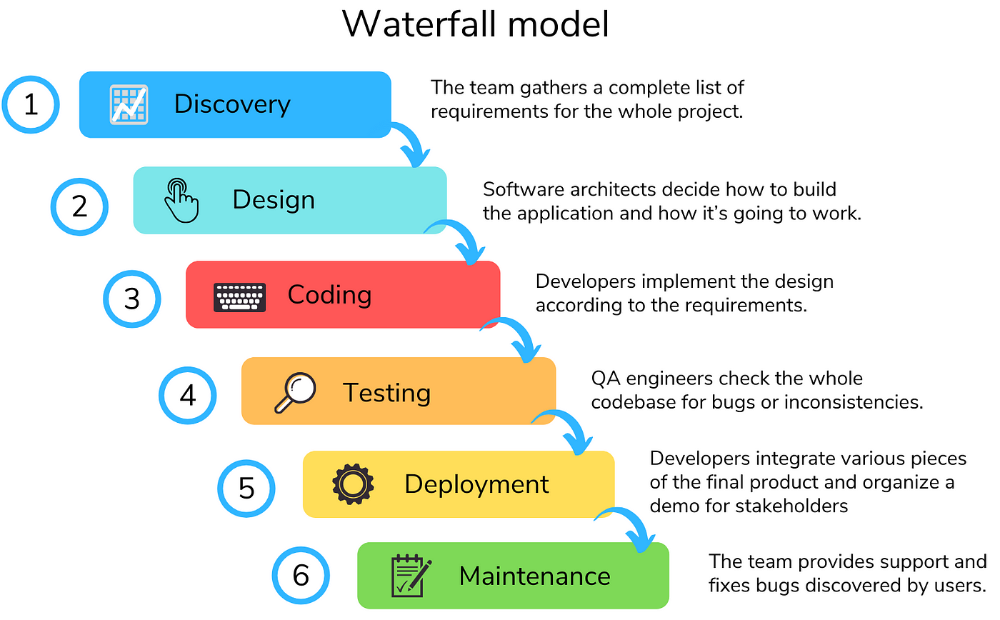

## Waterfall Model - Design
Waterfall approach was first SDLC Model to be used widely in Software Engineering to ensure success of the project. In "The Waterfall" approach, the whole process of software development is divided into separate phases. In this Waterfall model, typically, the outcome of one phase acts as the input for the next phase sequentially.

The following illustration is a representation of the different phases of the Waterfall Model.

### The sequential phases in Waterfall model are 

- Requirement Gathering and analysis − All possible requirements of the system to be developed are captured in this phase and documented in a requirement specification document
- System Design − The requirement specifications from first phase are studied in this phase and the system design is prepared. This system design helps in specifying hardware and system requirements and helps in defining the overall system architecture.
- Implementation − With inputs from the system design, the system is first developed in small programs called units, which are integrated in the next phase. Each unit is developed and tested for its functionality, which is referred to as Unit Testing.
- Integration and Testing − All the units developed in the implementation phase are integrated into a system after testing of each unit. Post integration the entire system is tested for any faults and failures.
- Deployment of system − Once the functional and non-functional testing is done; the product is deployed in the customer environment or released into the market.
- Maintenance − There are some issues which come up in the client environment. To fix those issues, patches are released. Also to enhance the product some better versions are released. Maintenance is done to deliver these changes in the customer environment.

All these phases are cascaded to each other in which progress is seen as flowing steadily downwards (like a waterfall) through the phases. The next phase is started only after the defined set of goals are achieved for previous phase and it is signed off, so the name "Waterfall Model". In this model, phases do not overlap.
* * *
## Waterfall Model - Application

- Requirements are very well documented, clear and fixed.
- Product definition is stable.
- Technology is understood and is not dynamic.
- There are no ambiguous requirements.
- Ample resources with required expertise are available to support the product.
- The project is short.
* * *
## Waterfall Model - Advantages

- Simple and easy to understand and use
- Easy to manage due to the rigidity of the model. Each phase has specific deliverables and a review process.
- Phases are processed and completed one at a time.
- Works well for smaller projects where requirements are very well understood.
- Clearly defined stages.
- Well understood milestones.
- Easy to arrange tasks.
- Process and results are well documented.
* * *
## Waterfall Model - Disadvantages

- No working software is produced until late during the life cycle.
- High amounts of risk and uncertainty.
- Not a good model for complex and object-oriented projects.
- Poor model for long and ongoing projects.
- Not suitable for the projects where requirements are at a moderate to high risk of changing. So, risk and uncertainty is high with this process model.
- It is difficult to measure progress within stages.
- Cannot accommodate changing requirements.
- Adjusting scope during the life cycle can end a project.
- Integration is done as a "big-bang. at the very end, which doesn't allow identifying any technological or business bottleneck or challenges early.
* * *
