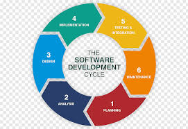

## What is SDLC?
SDLC is a process followed for a software project, within a software organization. It consists of a detailed plan describing how to develop, maintain, replace and alter or enhance specific software. The life cycle defines a methodology for improving the quality of software and the overall development process.

* * *

## Stage 1: Planning and Requirement Analysis
Requirement analysis is a crucial and foundational stage in the Software Development Life Cycle (SDLC). It is carried out by senior team members using inputs from customers, the sales department, market surveys, and industry experts. This gathered information is used to plan the project's basic approach and conduct a product feasibility study in economic, operational, and technical areas.

In the planning stage, quality assurance requirements are established, and potential project risks are identified. The technical feasibility study aims to outline the various technical methods that can be used to implement the project successfully while minimizing risks.
* * *
## Stage 2: Defining Requirements (Analysis)
Once the requirement analysis is done the next step is to clearly define and document the product requirements and get them approved from the customer or the market analysts. This is done through an **SRS (Software Requirement Specification)** document which consists of all the product requirements to be designed and developed during the project life cycle.
* * *
## Stage 3: Designing the Product Architecture
- The Software Requirements Specification (SRS) serves as a reference for product architects to develop the best architecture for the product. Based on the SRS, multiple design approaches for the product architecture are proposed and documented in a **Design Document Specification (DDS).**
- The DDS is reviewed by key stakeholders, who evaluate the proposed designs based on factors like risk assessment, product robustness, design modularity, budget, and time constraints. The best design approach is then selected.
- A chosen design approach specifies all architectural modules of the product, including their communication and data flow with external and third-party modules, if applicable. The internal design of all modules in the proposed architecture is detailed comprehensively in the DDS.
* * *
## Stage 4: Building or Developing the Product

- In this stage of the SDLC, the actual development process begins, culminating in the construction of the product. During this phase, programming code is generated in accordance with the specifications detailed in the Design Document Specification (DDS). A well-detailed and organized design facilitates smoother and more efficient code generation.
- Developers must strictly adhere to the coding guidelines established by their organization, ensuring consistency and quality across the codebase. They employ a variety of programming tools, such as compilers, interpreters, and debuggers, to assist in the code generation process. Depending on the specific requirements and nature of the software being developed, different high-level programming languages are utilized. These languages include, but are not limited to, C, C++, Pascal, Java, and PHP. The selection of the appropriate programming language is critical and is based on the software's intended functionality, performance requirements, and target platform.
* * *
## Stage 5: Testing the Product

This stage is usually a subset of all the stages as in the modern SDLC models, the testing activities are mostly involved in all the stages of SDLC. However, this stage refers to the testing only stage of the product where product defects are reported, tracked, fixed and retested, until the product reaches the quality standards defined in the SRS.
* * *
## Stage 6: Deployment in the Market and Maintenance

- Once the product is tested and ready to be deployed it is released formally in the appropriate market. Sometimes product deployment happens in stages as per the business strategy of that organization. The product may first be released in a limited segment and tested in the real business environment **(UAT- User acceptance testing)**.
- Then based on the feedback, the product may be released as it is or with suggested enhancements in the targeting market segment. After the product is released in the market, its maintenance is done for the existing customer base.
* * *
